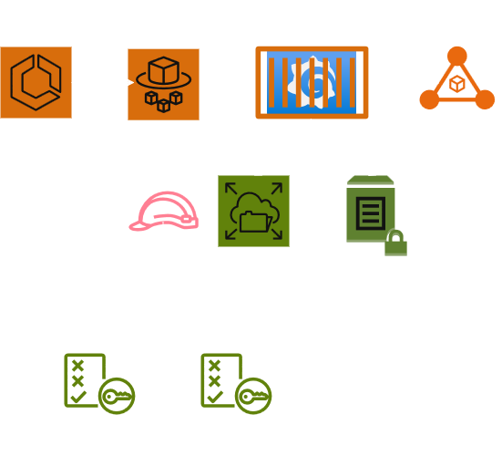

# expert-octo-succotash
ECS, EFS and Grafana PoC. Enabled for an IPv6 VPC.

## IPv6 problems and workaround 

If IPv6 is enabled in the VPC, ECS will preferentially connect to the EFS IPv6 addresses. 

```
Task is stopping
ResourceInitializationError: failed to invoke EFS utils commands to set up EFS volumes: stderr: Mount attempt 1/3 failed due to timeout after 15 sec, wait 0 sec before next attempt. Mount attempt 2/3 failed due to timeout after 15 sec, wait 0 sec before next attempt. b'mount.nfs4: mount system call failed' Traceback (most recent call last): File "/usr/sbin/supervisor_mount_efs", line 52, in <module> return_code = subprocess.check_call(["mount", "-t", "efs", "-o", opts, args.fs_id_with_path, args.dir_in_container], shell=False) File "/usr/lib64/python3.9/subprocess.py", line 373, in check_call raise CalledProcessError(retcode, cmd) subprocess.CalledProcessError: Command '['mount', '-t', 'efs', '-o', 'noresvport', 'fs-03b924b6fb7476e29:/', '/efs-vols/grafana-db']' returned non-zero exit status 32. During handling of the above exception, another exception occurred: Traceback (most recent call last): File "/usr/sbin/supervisor_mount_efs", line 56, in <module> "message": err.message, : unsuccessful EFS utils comma

```
This error is because the VPC is IPv6 enabled, so the security groups and EFS also need to be considered.  To fix this, EFS need to be made dual stack and the Security Groups need to be adjusted to allow NFS on TCP port 2049.




## Grafana persistence

Grafana saves it's configuration data to /var/lib/grafana as files and a SQLite database. One of the problems with the container is that /var/lib/grafana must be owned by uid:gid of 472 and allow group writeable permission.

### FIXES

#### Bodge

To "temporarily" this, we can create a /grafana directory on the EFS share and using an EC2, 

```
mount <EFS mount point>:/ /mnt
mkdir /mnt/grafana
chown 472:472 /mnt/grafana
chmod g+w /mnt/grafana 
umount /mnt
```
#### Proper Job

This was fixed with the ```aws_efs_access_point``` which sets the permissions correctly on the /grafana mount point.

```
resource "aws_efs_access_point" "grafana" {
  file_system_id = aws_efs_file_system.grafana[0].id

  root_directory {
    path = "/grafana"

    creation_info {
      owner_gid   = 472
      owner_uid   = 472
      permissions = "775"
    }
  }
}
```

### TIL

- grafana runs under uid 472 and so /var/lib/grafana needs to exist and chowned to that user
- Ubuntu not invented here syndrome is still very strong, so we need to use grafana/grafan


## INSTALL

## Install the infrastructure for Deploying to AWS

Create a ```terraform.tfvars``` with content similar to the following to allow the R53 records to be created dynamically. The access_ips will be a list of allowed IPs which can access the ALB:
``` 
domain_name = "bobbins.org"
access_ips = ["1.22.33.44/32"]
```

Deploy the terrafom as normal

```
tofu init
tofu plan
tofu apply
```
